# Atlas (Mingyi)

<div align="right">

简体中文 | [English](./README_EN.md)

</div>

Mingyi 是一个基于 Electron 的本地 AI Agent 桌面应用：将现代化本地 AI Agent 的 AgentController、统一模型路由、多工作模式、扩展中心与插件、安全工具、MCP 及会话状态流封装成本地通用 Runtime，并通过类型完备的 IPC 协议暴露给桌面端。支持多任务与项目空间的分组管理、多厂商模型服务无缝切换、多步工具流水线执行、内置集成终端以及面向授权安全评估的渗透测试（Pentest）可视化工作流。

> [!WARNING]
> **开发阶段说明 (Notice for Early Development Phase)**
> 
> 本项目当前处于**高频迭代的活跃开发早期阶段（Alpha / Experimental）**。系统的底层架构（AgentController/Runtime）、数据持久化机制、IPC 交互契约以及桌面端 UI 随时可能发生较大幅度的重构与 Breaking Changes。
> 
> 欢迎社区开发者测试体验并提供宝贵反馈与建议！如果在生产环境或关键场景中使用，请务必注意重要数据的本地备份与版本锁定。

## 工作运行截图

<table width="100%">
  <tr>
    <td width="50%" align="center"><b>实时渗透测试执行链路与思考</b></td>
    <td width="50%" align="center"><b>完整工作区、黑板事实与漏洞发现</b></td>
  </tr>
  <tr>
    <td align="center">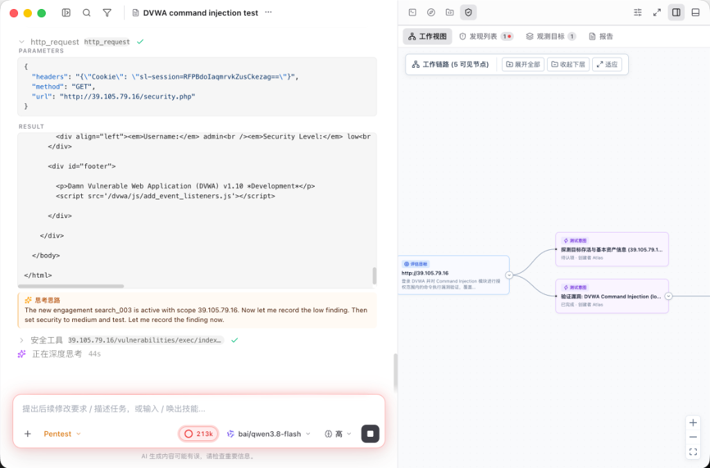</td>
    <td align="center">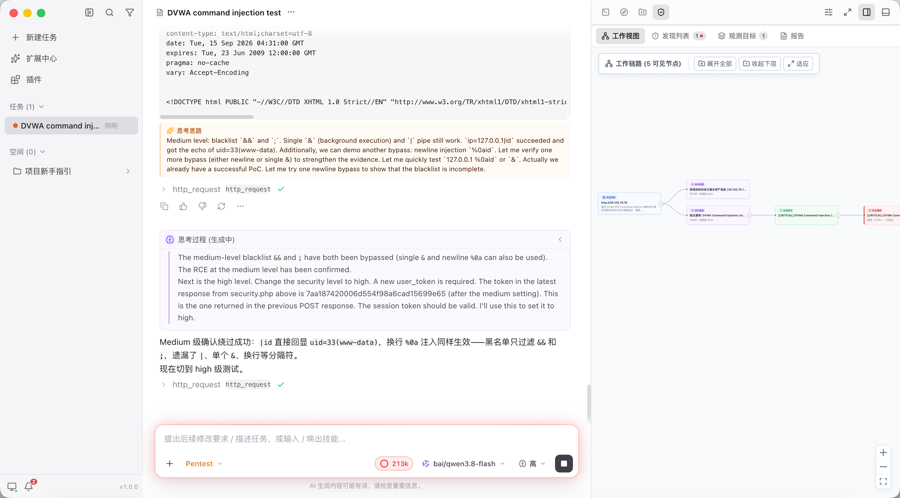</td>
  </tr>
  <tr>
    <td colspan="2" align="center"><b>多安全等级实证验证与漏洞发现面板</b></td>
  </tr>
  <tr>
    <td colspan="2" align="center">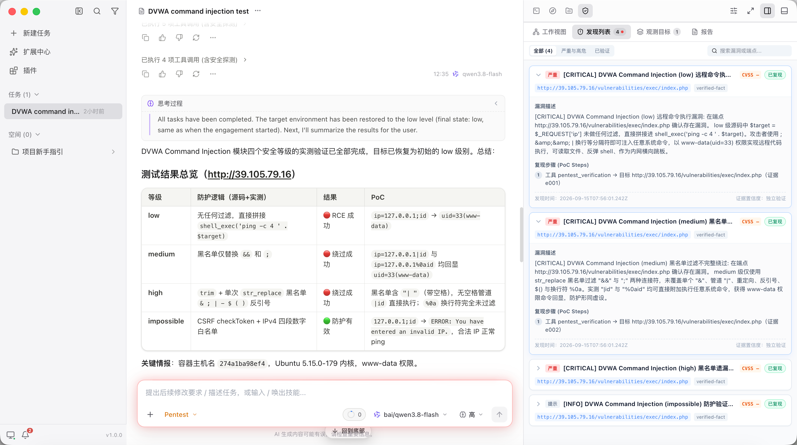</td>
  </tr>
</table>

## 功能截图

<table width="100%">
  <tr>
    <td width="50%" align="center"><b>主界面与步骤执行</b></td>
    <td width="50%" align="center"><b>任务快捷操作</b></td>
  </tr>
  <tr>
    <td align="center">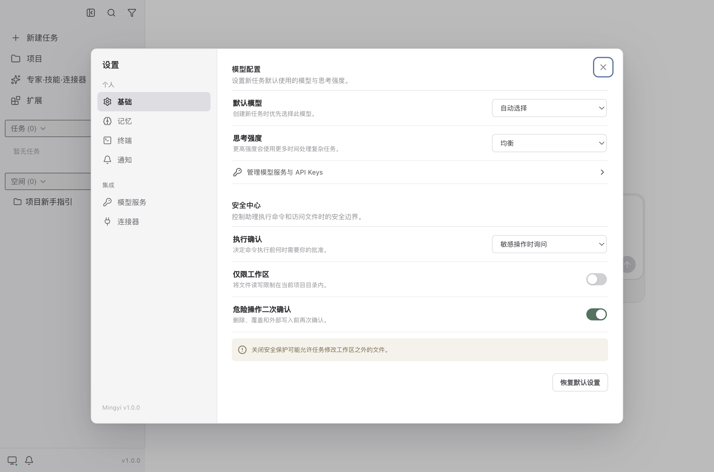</td>
    <td align="center">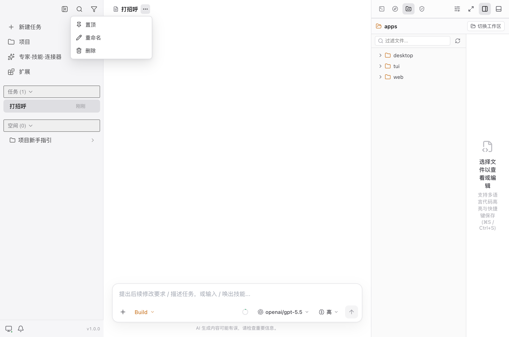</td>
  </tr>
  <tr>
    <td align="center"><b>侧栏任务与空间管理</b></td>
    <td align="center"><b>内置终端面板 (⌘J)</b></td>
  </tr>
  <tr>
    <td align="center">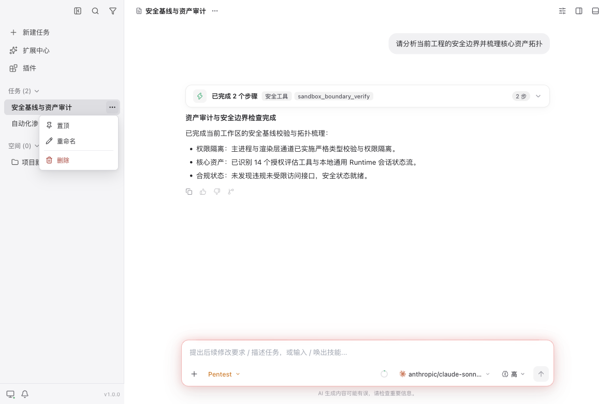</td>
    <td align="center">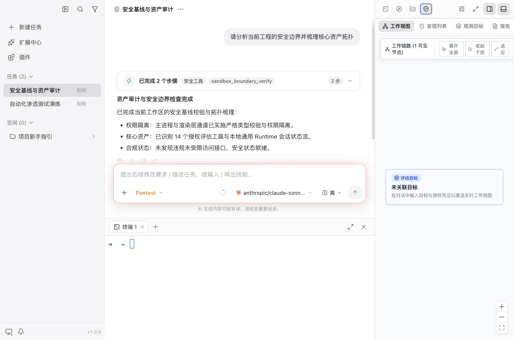</td>
  </tr>
  <tr>
    <td align="center"><b>统一模型服务配置</b></td>
    <td align="center"><b>Pentest 渗透测试工作流</b></td>
  </tr>
  <tr>
    <td align="center">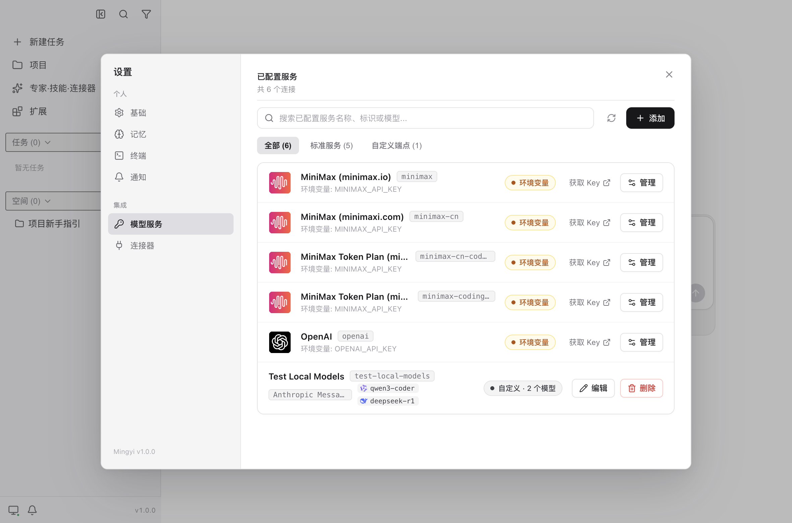</td>
    <td align="center">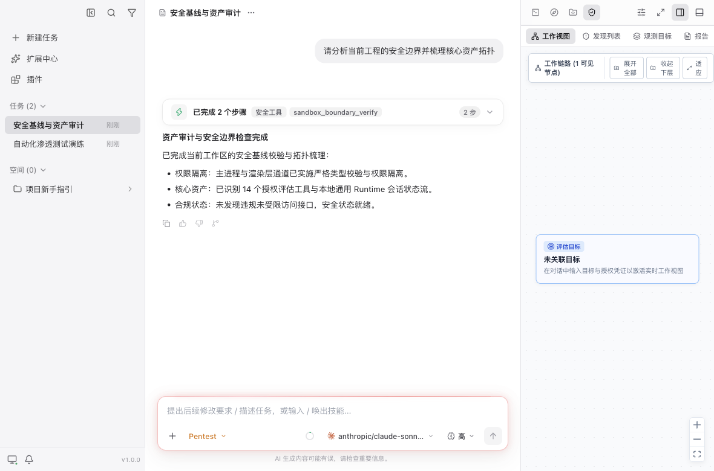</td>
  </tr>
  <tr>
    <td align="center"><b>开源致谢与社区贡献</b></td>
    <td align="center"><b>扩展中心与专家角色</b></td>
  </tr>
  <tr>
    <td align="center">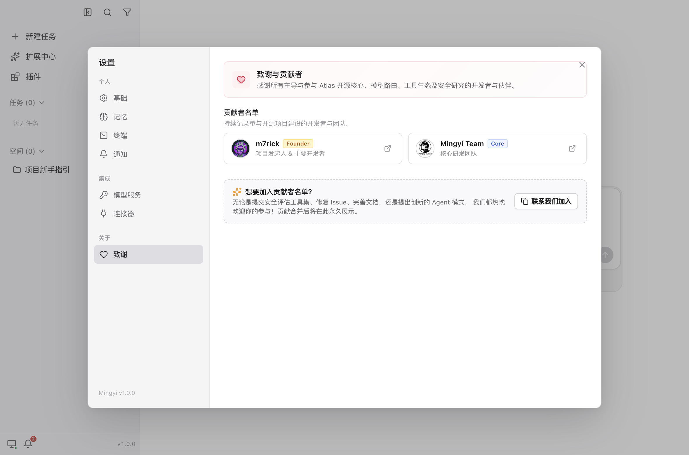</td>
    <td align="center">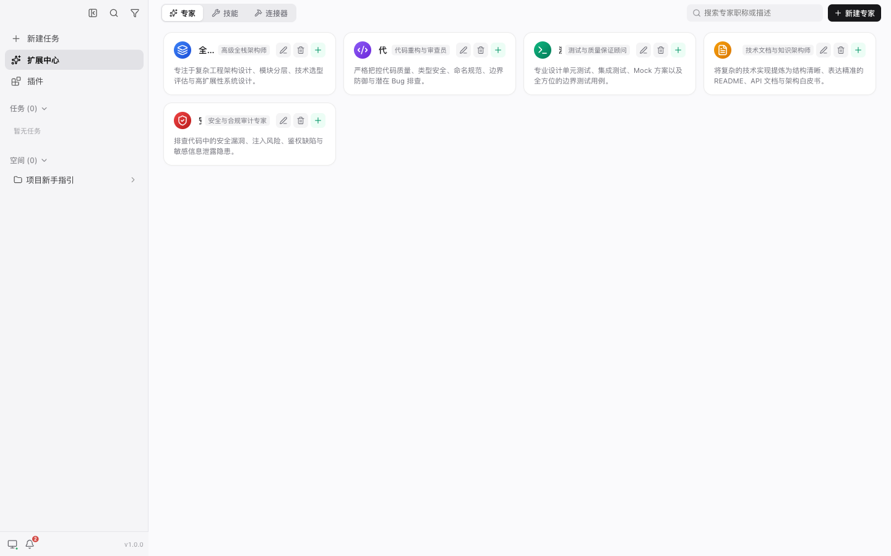</td>
  </tr>
</table>

## 仓库结构

```
.
├── apps/desktop        # Electron 桌面应用（主进程 / preload / renderer）
├── packages/runtime    # 通用本地 Agent Runtime（开源核心）
├── docs                # 架构设计、ADR 与发布指南
└── patches             # 依赖补丁
```

- `packages/runtime/`：通用的本地 AI Agent 核心 Runtime，提供 AgentController、Session、统一模型路由、模式（Mode）、Subagent、工具执行、MCP 协议支持、技能与自动化引擎，并内建面向授权安全评估的 Pentest 域能力；Desktop 与 TUI 等应用层只通过 Runtime 的稳定公开接口调用。
- `apps/desktop/`：Electron 应用，主进程代码在 `src/main/`，preload API 在 `src/preload/`，浏览器 UI 在 `src/renderer/`。

## 接入与配置指南 (Integration & Configuration)

### 1. 模型服务接入 (Model Providers)
支持主流闭源大模型与开源本地推理端点，统一由 Runtime 模型路由进行安全调度：
- **公有云 API**：OpenAI、Anthropic、Google Gemini、DeepSeek、SiliconFlow 等；
- **本地/私有化端点**：Ollama、vLLM、LocalAI 等兼容 OpenAI 协议的自建服务；
- **统一设置**：在桌面端左下角点击 `设置 -> 模型服务`，即可可视化增删改查 Provider API Key 与 Base URL，或通过环境变量快捷注入。

### 2. 安全评估与 Kali 沙箱接入 (Security Sandbox)
为防止自动化渗透测试对宿主机造成意外破坏或端口冲突，系统原生提供 Docker 纯执行沙箱适配层（详细指南见 [container/README.md](./container/README.md)）：
- **构建本地沙箱镜像**：
  ```bash
  docker build -t mingyi-sandbox:latest ./container
  ```
  *(镜像内置完整 Kali 安全工具链、离线 PoC 库及 HackTricks/PayloadsAllTheThings 知识库)*
- **启动常驻沙箱容器**（亦可通过 `npm run container:run` 跨平台一键启动）：
  ```bash
  # macOS / Linux (工作区默认映射至 ~/.atlas/sandbox_workspace)
  docker run -d \
    --name mingyi-sandbox \
    --network host \
    --cap-add=NET_RAW --cap-add=NET_ADMIN \
    -v ~/.atlas/sandbox_workspace:/home/kali/workspace \
    mingyi-sandbox:latest

  # Windows (工作区默认映射至 %USERPROFILE%\.atlas\sandbox_workspace)
  docker run -d ^
    --name mingyi-sandbox ^
    --network host ^
    --cap-add=NET_RAW --cap-add=NET_ADMIN ^
    -v "%USERPROFILE%\.atlas\sandbox_workspace:/home/kali/workspace" ^
    mingyi-sandbox:latest
  ```
- **自动化探测与握手**：
  Agent 在执行前会自动调用内置的 `detect_sandbox_environment` 工具探测当前环境。只有在触发 `kali_*` 系列工具时才向沙箱下发执行指令，未启用时零资源开销；
- **配置与环境变量**：
  - `MINGYI_SANDBOX_CONTAINER`：指定容器名称（默认 `mingyi-sandbox`）；
  - `MINGYI_SANDBOX_IMAGE`：指定镜像名称（默认 `mingyi-sandbox:latest`）；
  - `MINGYI_SANDBOX_WORKSPACE_DIR`：指定宿主机工作区挂载目录（默认 `~/.atlas/sandbox_workspace`，Windows 为 `%USERPROFILE%\.atlas\sandbox_workspace`）；
  - `MINGYI_SANDBOX_DISABLED=1`：一键关闭沙箱桥接，直接在宿主环境受限执行。

### 3. 数据与存储架构接入 (Storage & Persistence)
系统遵循“引擎状态机 + 向量记忆 + 项目私有隔离”的三层存储体系：
- **全局 Runtime 存储**：会话状态、Message 树以及向量检索记忆集中持久化在数据库中（支持通过 `MASTRA_APP_DATA_DIR` 统一指定如 `~/.atlas/`），包含任务 SQLite 库与向量索引库（`vectors.db`）；
- **工作区项目本地存储**：每个目标代码工程下的渗透测试任务黑板、靶标资产、漏洞发现与证据链统一保存在工程根目录的 `.mingyi/pentest/` 中，天然支持与 Git 协同和审计归档；
- **项目专家角色**：支持在项目 `<workspace>/.mastracode/agents/*.md` 中放置专属的专家人设，随工程自动加载为 Mode。

### 4. 自定义工具与 MCP 协议扩展接入 (Custom Tools & MCP Integration)
Atlas 具备高度开放的双轨扩展能力，支持安全研究员和开发者自由扩充：
- **原生安全工具扩展 (Native Security Tools)**：
  1. 在 `packages/runtime/src/tools/security-tools/` 新增工具实现（需实现 `RuntimePentestTool` 接口规范）；
  2. 声明工具的参数 schema（Zod 校验）、只读性（`readOnly`）及执行回调；
  3. 在 `index.ts` 导出并经 `DEFAULT_PENTEST_TOOLS` 自动注册进 Agent 调度图，受 `packages/runtime/test/tool-layout.test.ts` 架构守护。
- **标准 MCP 协议服务接入 (Model Context Protocol)**：
  - 原生内建 MCP 客户端管理器，支持接入任意遵循 MCP 规范的外部工具服务器（如外部数据库、代码语义索引、自定义扫描器）；
  - 可通过配置动态挂载为 Agent 工具，无需修改前端即可实现全流程交互与参数悬停审批。
- **项目技能 (Skills) 自动化**：
  - 支持在项目 `.agents/skills/<skill_name>/SKILL.md` 中以结构化 Markdown 形式封装专家操作经验；
  - 智能体可自动匹配语义并在对话中直接调度对应技能流水线。

## 参与贡献与发布指南 (Contributing & Release)

欢迎社区安全研究员、模型工程研究者与全栈开发者共同完善 Atlas！
* **贡献者荣誉墙**：项目桌面客户端内建了【开源致谢与社区贡献】专属面板（`设置 -> 关于我们 -> 致谢与贡献`，见上方功能截图）。所有提交有效 PR、完善安全工具规则、扩展 MCP 或优化核心 Runtime 的贡献者，其 GitHub 个人资料与主页链接将被永久铭刻在应用致谢面板中；
* **构建与发版规范**：详细的本地开发规范、Conventional Commits 提交约定以及跨平台自动化 CI/CD 打包流水线（macOS DMG/ZIP、Linux AppImage/deb、Windows NSIS/ZIP）请参阅：
👉 **[Atlas 版本发布与贡献指南 (Release Guide)](./docs/release-guide.md)**

## 快速开始

先在仓库根目录安装依赖：

```bash
npm install
```

常用命令：

```bash
# 启动 Electron 应用（开发模式）
npm run dev

# 构建与类型检查
npm run build
npm run typecheck

# 测试
npm test                          # Desktop Playwright E2E（无头）
npm run test -w @mingyi/runtime   # Runtime Vitest 单测

# Lint 与格式化
npm run lint
```

要求 Node.js >= 22.19。

## Runtime 使用示例

```typescript
import { createLocalRuntime } from '@mingyi/runtime'

const runtime = await createLocalRuntime({
  workspacePath: '/path/to/project',
})

// Desktop 通过 IPC 暴露 runtime.sessions 的可序列化接口；
// TUI 等简单场景可直接使用 runtime.session
await runtime.sessions.create({ title: '新任务' })
await runtime.sessions.sendMessage({ sessionId, content: '你好' })

await runtime.shutdown()
```

## 致谢与开源基石 (Acknowledgements & Credits)

Atlas (Mingyi) 的诞生离不开现代开源 AI 与前端交互生态的卓越贡献。我们向以下优秀的开源项目、设计哲学及其研发团队致以诚挚的感谢：

- **[Mastra](https://mastra.ai/)** (`@mastra/core` & `@mastra/code-sdk`)：为 Atlas 提供了工业级、稳健的本地 AgentController 引擎底座、工作模式（Modes）、工具编排体系与会话状态持久化能力；
- **[assistant-ui](https://github.com/assistant-ui/assistant-ui)** (`@assistant-ui/react`)：为桌面端呈现极致流畅、可组合且具备丰富交互细节的现代化生成式 AI 对话与工具流体验；
- **[Vercel AI SDK](https://sdk.vercel.ai/)** (`ai`)：为系统提供了优雅、统一的流式消息协议、工具执行生命周期以及跨模型交互的标准数据契约；
- **[Electron](https://www.electronjs.org/)** & **[React](https://react.dev/)**：构建高性能、原生集成终端与跨平台安全演练桌面工作台的坚实基础。

## 许可证与商业授权 (License & Commercial Use)

本项目开源核心部分遵循 **[GNU Affero General Public License v3.0 (AGPLv3)](./LICENSE)** 许可证。

- **个人学习、研究与内部自用**：完全免费，可在遵守 AGPLv3 的前提下自由运行、修改和分发。
- **免除开源约束 / 商业化使用**：
  若您或您的机构存在以下需求，无法或不愿遵守 AGPLv3 的强开源传染条款（包括但不限于向网络用户开放全部衍生系统源码）：
  - 将本项目闭源集成进企业自研的商业产品中；
  - 规避 AGPLv3 的网络分发（Section 13）传染限制；
  - 寻求定制开发、企业级 SLA 支持或官方商业版 SaaS 插件扩展。

请联系我们获取 **商业许可证（Commercial License）**：
- 团队: Mingyi ([@MingyiSecLab](https://github.com/MingyiSecLab))
- 邮箱: `starrepository@gmail.com`

---

### License & Commercial Use (English)

The core open-source codebase of this project is licensed under the **[GNU Affero General Public License v3.0 (AGPLv3)](./LICENSE)**.

- **Non-commercial / Community Use**: Free for personal learning, research, and internal deployment under the terms of the AGPLv3.
- **Commercial Licensing**: If your organization requires closed-source distribution, integration into proprietary products, or wants to operate without the copyleft obligations of AGPLv3 (such as the Section 13 network-interaction requirement), you must obtain a **Commercial License**.

For commercial licensing and enterprise inquiries, please visit [@MingyiSecLab](https://github.com/MingyiSecLab) or contact: `starrepository@gmail.com`
